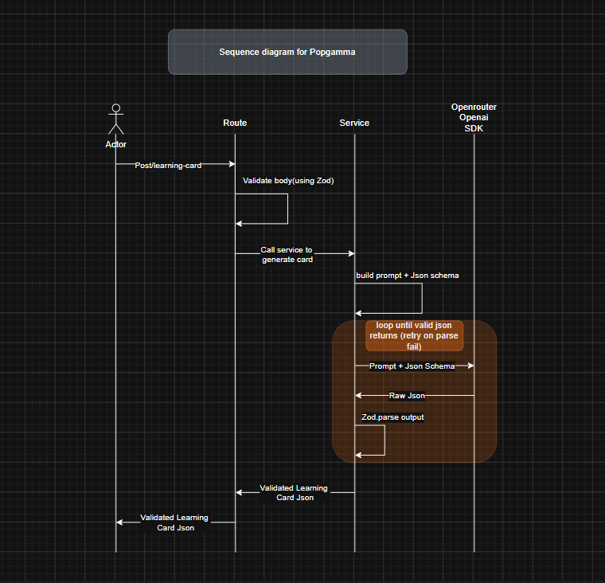

# PopGamma — Learning Card Generator

A small TypeScript + Node.js (Fastify) backend that turns a `{ board, grade, concept }`
request into a structured **learning card** that teaches the concept to a Class-9 to 12  child.

The card is generated by an LLM (via OpenRouter) and returned as clean, validated JSON
that a frontend can render directly — including **LaTeX** for math notation and **at least
one structured visual** (graph, table, or flowchart) as data, never as a pre-rendered image.

## What it does

Given a request like:

```json
POST /learning-card
{ "board": "CBSE", "grade": 9, "concept": "Slope-intercept form of a line (y = mx + c)" }
```

it returns a card with:

- `meta` — echoes back `board`, `grade`, `concept`
- `title` — a short title for the concept
- `sections` — 1–4 short teaching sections (`heading` + `body`)
- `keyFormulas` — up to 4 formulas as raw LaTeX with a one-line explanation
- `workedExample` — a question plus step-by-step solution
- `visual` — exactly one of `graph`, `table`, or `flowchart`, expressed as structured data

Math is represented as **raw LaTeX**: `keyFormulas[].latex` and `visual.functionLatex`
contain bare expressions (no `$` delimiters), while prose fields (`body`, `explanation`)
may use inline `$...$`. This keeps rendering decisions on the frontend.

## How it works

The flow is intentionally simple: validate input → build prompt → call the model →
validate the model's output against a Zod schema → retry once if it doesn't match.



> Editable source: [draw.io sequence diagram](https://app.diagrams.net/#G1bkIvjYOzqfOlQUccD84jtrLTF0VdY0cG#%7B%22pageId%22%3A%22SHFyZP6v-04pAmH4nU5a%22%7D)

1. **Route (`src/server.ts`)** receives `POST /learning-card` and validates the request body
   with a shared Zod schema (`RequestSchema`). Invalid bodies return `400` with details.
2. **Service (`src/cardService.ts`)** builds the system + user prompt, which pins down the
   exact JSON shape, the section/formula/visual limits, and the LaTeX formatting rules.
3. The service calls the model through the **OpenRouter / OpenAI SDK** (`src/llm.ts`) with
   `response_format: json_object` so the model returns JSON.
4. The raw JSON is parsed and validated against `LearningCardSchema`. If parsing or
   validation fails, the service **retries once**, feeding the model its previous (bad)
   output plus the validation error so it can self-correct.
5. A validated `LearningCard` is returned to the route, which sends it back as `200`.
   If the model still produces invalid data after the retry, the route returns `502`.

### Project layout

| File | Responsibility |
| --- | --- |
| `src/index.ts` | Boots the Fastify server, handles graceful shutdown |
| `src/server.ts` | HTTP routing, request validation, auth (register/login + JWT guard), error → status mapping |
| `src/cardService.ts` | Prompt building, LLM call, output validation, retry logic |
| `src/schema.ts` | Zod schemas for the request, auth bodies, and the learning card (single source of truth) |
| `src/llm.ts` | OpenRouter/OpenAI client + model configuration |
| `src/userStore.ts` | User creation & credential verification (bcrypt password hashing) |
| `src/db.ts` | SQLite connection and `users` table bootstrap |

## Authentication

The `POST /learning-card` endpoint is protected. Clients must register or log in to
obtain a **JWT**, then send it as a `Bearer` token on every card request.

- **Passwords** are never stored in plain text — `src/userStore.ts` hashes them with
  **bcrypt** (cost factor 12) before they touch the database.
- **Users** live in a SQLite `users` table (`src/db.ts`), with a unique constraint on
  `email` so duplicate sign-ups are rejected.
- **Tokens** are signed with `@fastify/jwt` using `JWT_SECRET` and expire after
  `JWT_EXPIRES_IN` (default `1h`). The token payload carries the user's `id` and `email`.
- The `authenticate` pre-handler in `src/server.ts` verifies the token on protected routes
  and returns `401` if it is missing or invalid.

### Endpoints

| Method | Path | Auth | Body | Returns |
| --- | --- | --- | --- | --- |
| `POST` | `/register` | none | `{ email, password }` | `201 { token }` |
| `POST` | `/login` | none | `{ email, password }` | `200 { token }` |
| `POST` | `/learning-card` | Bearer JWT | `{ board, grade, concept }` | `200` learning card |
| `GET` | `/health` | none | — | `{ "status": "ok" }` |

`email` must be a valid email and `password` must be at least 8 characters (enforced by
`RegisterSchema` in `src/schema.ts`). Registering an existing email returns `409`, and bad
credentials on login return `401`.

## Setup & run

### Prerequisites

- Node.js 18+ (uses native `fetch`/ESM)
- An [OpenRouter](https://openrouter.ai/) API key

### Install

```bash
cd PoPGamma-master
npm install
```

### Configure

Create a `.env` file in the project root:

```bash
OPENROUTER_API_KEY=sk-or-v1-your-key-here
OPENROUTER_MODEL=openai/gpt-4.1-nano   # optional, defaults to openai/gpt-4o-mini
PORT=3000                              # optional, defaults to 3000
JWT_SECRET=change-me                   # required — used to sign/verify auth tokens
JWT_EXPIRES_IN=1h                      # optional, defaults to 1h
DATABASE_PATH=./data/app.db            # optional, defaults to ./data/app.db
```

### Run

```bash
npm run dev      # development with hot reload (tsx watch)
```

The server listens on `http://localhost:3000`.

### Try it

First create an account (or log in) to get a token:

```bash
curl -X POST http://localhost:3000/register \
  -H "Content-Type: application/json" \
  -d '{ "email": "you@example.com", "password": "supersecret" }'
# -> { "token": "eyJhbGci..." }
```

Then call the protected endpoint with the token as a `Bearer` header:

```bash
curl -X POST http://localhost:3000/learning-card \
  -H "Content-Type: application/json" \
  -H "Authorization: Bearer eyJhbGci..." \
  -d '{ "board": "CBSE", "grade": 9, "concept": "Slope-intercept form of a line (y = mx + c)" }'
```

There is also a liveness probe at `GET /health` that returns `{ "status": "ok" }`
without making an LLM call.

## Key design choices & trade-offs

- **Zod as the single source of truth.** The same schemas validate both the incoming
  request and the model's output, and the TypeScript types are inferred from them
  (`z.infer`). This guarantees that what the route returns actually matches the contract.
- **Visuals as a discriminated union.** `visual` is a `graph | table | flowchart` keyed on
  `type`, so the frontend can switch on one field and render the structured data — no
  pre-rendered images. Each variant carries size caps (e.g. graph point counts, table
  row/column limits) to keep payloads renderable.
- **Validate-then-retry instead of trusting the model.** The model can drift from the
  schema, so the service parses and validates every response. On failure it retries exactly
  **once**, showing the model its own bad output plus the error. One retry balances
  reliability against latency and cost.
- **Prompt enforces formatting rules, schema enforces correctness.** The prompt asks for
  concise content and clean LaTeX (no `$` in formula fields); the schema is the hard
  guarantee. If they disagree, the schema wins.
- **Intentionally concise responses to spark follow-up questions.** The card is kept short and high-level rather than exhaustive — small section/formula limits and brief bodies are a deliberate choice, not just a cost or latency measure. The goal is to teach the core idea and leave the learner curious enough to ask follow-up questions about the topic, rather than overwhelming them with a wall of detail up front.
- **OpenRouter via the OpenAI SDK.** Using the OpenAI-compatible client against OpenRouter
  keeps the integration familiar and makes the underlying model swappable through one env
  var (`OPENROUTER_MODEL`).
- **Bounded output (`max_tokens: 1200`, `temperature: 0.4`).** Caps worst-case latency and
  keeps generations deterministic enough to be reliable, while leaving room for a full card.
- **Clear error mapping.** Bad client input → `400`; missing/invalid token → `401`; duplicate
  email → `409`; a model that can't produce valid data → `502`, so callers can distinguish
  their fault from an upstream failure.
- **Stateless JWT auth with hashed passwords.** Auth is handled with short-lived JWTs
  (`@fastify/jwt`) so the API stays stateless and horizontally scalable, while passwords are
  hashed with bcrypt — the database never sees a plain-text password. The same Zod schema
  validates register and login bodies.

## What I'd do with more time

- **Automated tests.** Unit tests for the schema and retry logic (with a mocked LLM client),
  plus an integration test for the route covering the `400` / `200` / `502` paths.
- **Streaming responses** so a frontend can render sections progressively.
- **Caching** identical `{ board, grade, concept }` requests to cut latency and cost.
- **Rate limiting** and refresh tokens / token revocation to harden the existing JWT auth
  before exposing the endpoint publicly.
- **Richer visuals** (e.g. multiple visuals per card, more graph metadata) and per-board
  prompt tuning.
- **Observability** — request/latency metrics and structured logging of validation-failure
  rates to spot prompt regressions.
